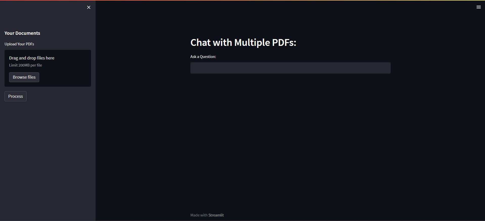
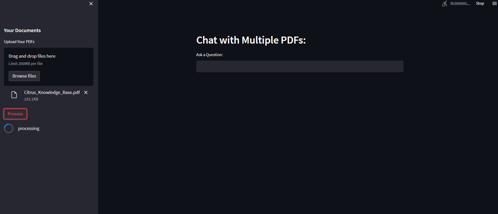
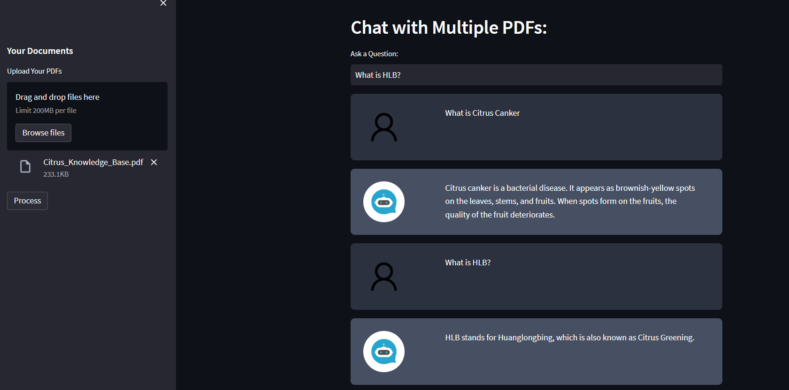

# OTG-RAG : Checkout here at ([streamlit}(https://st-chatpdf.streamlit.app/))

This is a chatbot made to chat with multiple PDFs.
Add the number of PDFs that you need (limit 200MB),
Process it,
And then Chat.

---

Then, pdf files can be dragged and drooped there or simply selected.

---

Finally the input can be placed at the textbox and when pressed **Enter** the bot accepts the input
and gives the output.

